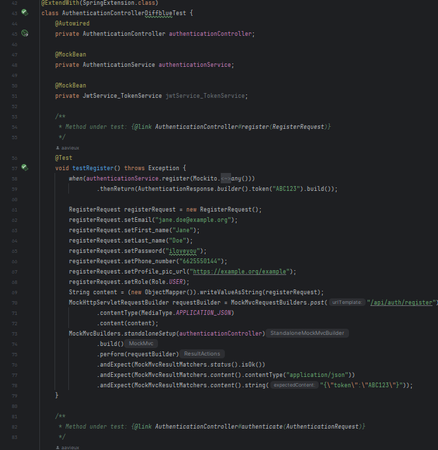
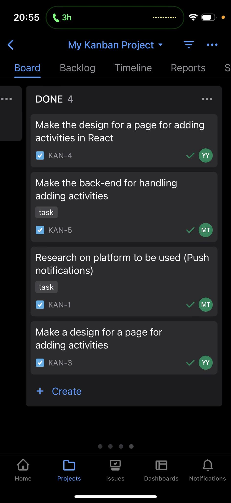

# Portfolio of my work from semester 3

Aleksandar Garkov
Class: 
Teachers: Jean Paul Ligthart, Samuil Angelov and Monique Vissers

## My Website
- Git Repository: https://github.com/aavieux/portfolio-s3
- Research Report: https://github.com/...
---
## Table of Contents
1. [Introduction](#1-introduction)
2. [Learning Outcomes](#2-learning-outcomes)
    1. [Web Application](#lo1-web-application)
    2. [Software Quality](#lo2-software-quality)
    3. [Agile Methods](#lo3-agile-methods)
    4. [CI/CD](#lo4-cicd)
    5. [Cultural Differences and Ethics](#lo5-cultural-differences-and-ethics)
    6. [Requirements and Design](#lo6-requirements-and-design)
    7. [Business Processes](#lo7-business-processes)
    8. [Professional](#lo8-professional)

## 1. Introduction

Welcome to my ICT and Software Engineering portfolio! This portfolio shows my work throughout the research, development and testing of my latest software projects in university.

## 2. Learning Outcomes

| #   | Name                            | Short description                                                                                                                           | Clarification                                                                                                                                                                                                                                                                                                                                                                                                                                                    |
| --- | ------------------------------- | ------------------------------------------------------------------------------------------------------------------------------------------- | ---------------------------------------------------------------------------------------------------------------------------------------------------------------------------------------------------------------------------------------------------------------------------------------------------------------------------------------------------------------------------------------------------------------------------------------------------------------- |
| 1   | Web application                 | You design and build **user-friendly, full-stack** web applications.                                                                        | **User friendly:** You apply basic User experience testing and development techniques. **Full-stack:** You design and build a full stack application using commonly accepted front end (JavaScript-based framework) and back end techniques (e.g. Object Relational Mapping) choosing and implementing relevant communication protocols and addressing asynchronous communication issues.                                                                     |
| 2   | Software quality                | You use software **tooling and methodology** that continuously monitors and improve the software quality during software development.       | **Tooling and methodology:** Carry out, monitor and report on unit integration, regression and system tests, with attention for security and performance aspects, as well as applying static code analysis and code reviews.                                                                                                                                                                                                                                     |
| 3   | Agile method                    | You **choose** and implement the most suitable agile software development method for your software project.                                 | **Choose:** You are aware of the most popular agile methods and their underlying agile principles. Your choice of a method is motivated and based on well-defined selection criteria and context analyses.                                                                                                                                                                                                                                                       |
| 4   | CI/CD                           | You **implement** a (semi)automated software release process that matches the needs of the project context.                                 | **Implement:** You implement a continuous integration and deployment solution (using e.g. Gitlab CI and Docker).                                                                                                                                                                                                                                                                                                                                                 |
| 5   | Cultural differences and ethics | You **recognize** and **take into account** cultural differences between project stakeholders and ethical aspects in software development.  | **Recognize**:  Recognition is based on theoretically substantiated awareness of cultural differences and ethical aspects in software engineering. **Take into account:** Adapt your communication, working, and behavior styles to reflect project stakeholders from different cultures; Address one of the standard Programming Ethical Guidelines (e.g., ACM Code of Ethics and Professional Conduct) in your work.                                     |
| 6   | Requirements and Design         | You analyze (non-functional) requirements, elaborate (architectural) designs and validate them using **multiple types of test techniques**. | **Multiple types of test techniques:** You apply user acceptance testing and stakeholder feedback to validate the quality of the requirements. You evaluate the quality of the design (e.g., by testing or prototyping) taking into account the formulated quality properties like security and performance.                                                                                                                                                     |
| 7   | Business processes              | You analyze and describe **simple** business processes that are **related** to your project.                                                | **Simple:** Involving stakeholders, predominantly sequential processes with one or two alternative paths. **Related:** Business processes during which the software that you are developing will be used (business processes that the software must support by fully or partially automating them). **or** Business processes needed for the success of your software development project (e.g., product release, market release, financial assurance). |
| 8   | Professional                    | You act in a **professional manner** during software development and learning.                                                              | **Professional manner:** You develop software as a team effort according to a prescribed software methodology and following team agreements. You are able to track your work progress and communicate your progress with the team. You actively ask and apply feedback from stakeholders and advise them on the most optimal technical and design (architectural) solutions. You choose and substantiate solutions for a given problem.                       |

## LO1. Web Application

INDIVIDUAL PROJECT

  My individual project application called "Online Library" has the following key features:
    
    1. Extensive Book Repository:
    Dive into a vast and diverse collection of books encompassing various genres, from timeless classics to contemporary masterpieces.
    
    3. Personalized Libraries and Bookshelves:
    Create your unique reading space by curating personalized libraries. Add your favorite books, organize them into thematic bookshelves, and design your literary world.
    
    4. Social Networking for Readers:
    Connect with fellow book lovers, expand your reading circle, and forge meaningful connections. Follow your friends, see their reading lists, and discover new titles through their recommendations.
    
    5. Author Interactions and Insights:
    Stay updated with your favorite authors. Follow their profiles, delve into their bibliographies, and receive notifications about their latest releases.
    
    6. Interactive Book Reviews and Discussions:
    Share your thoughts through detailed book reviews.

GROUP PROJECT

  The primary goal of the group project is to streamline the integration and orientation process for new students at Maua by developing a comprehensive web application. The impetus behind this project is the recognition of the challenges faced by incoming students in navigating the activities, locations, and organizations within the university.  
The advantages of this project are multifaceted: it simplifies the onboarding process, enhances student experience. By providing a centralized platform for essential information such as campus activities, interactive maps, and organizational directories, the web application adds significant value to the university’s service offering. It enriches the educational environment by fostering a sense of community and belonging among students.

In the beginning we spoke with the product owner and he gave us wireframes, explaining how the application should look like.

Non functional requirements for both of the project are:

    1.	Usability 
    1.1. The software should be user-friendly and intuitive. 
    1.2. The software should have a consistent and visually appealing design. 
    1.3. The software should have clear and concise error messages.
    2.	Performance 
    2.1. The software should be responsive and fast. 
    2.2. The software should handle large amounts of data efficiently. 
    2.3. The software should have minimal downtime.
    3.	Reliability 
    3.1. The software should be stable and reliable. 
    3.2. The software should have backup and recovery mechanisms in case of data loss.
    4.	Security 
    4.1. The software should be secure and protect sensitive data. 
    4.2. The software should comply with industry-standard security protocols. 
    4.3. The software should have a mechanism for identifying and preventing unauthorized access.

### UI prototyping

I have made a lot of UI prototyping, self-studying and researching for my individual project. I researched the most famous online libraries and their UI structure and watched a few explanations on why their UI is user-friendly and effective.

A prototype of my individual project you can see on page [Requirements and Design](#lo6-requirements-and-design)

I also did some usability tests in school with my peers. I showed my prototype and overrall the feedback was positive including some remarks and suggestions from their side.

After a final discussion with the product owner I finally decided to implement my prototype.

For the group project we had already a chosen UI from the product owner. 

### Software Development

  INDIVIDUAL PROJECT

To have a better understanding of what the most important features are in the project, I conducted a survey, which my classmates filled in, giving opinion by rating the importance of features and giving more ideas, which they believe are important. You can check the answers [here](files/form.pdf).
Based on the answers I prioritized my tasks accordingly.

In the beginning, the difficulties I have faced were that the technologies I wanted to use were foreign to me and I had to make an extensive research how the project should be structured.

The first thing that I started doing is the main page. I decided to split in half horizontally. In the upper side I have put the books that are recommended to the user based on their searches, saved books, favourite author, etc. The algorythm for this is also a user requirement which is yet to be implemented.

The second half shows the most recently added books in the database.

Regardless of the location of the user throughout the application, he/she can always access the dashboards on the left and right with list of common sections and friend list respectively.

My second task was actually the most important feature which is the option to search and filter books by name, author, genre, etc.

I also implemented in the first weeks of the development, the option to save books in your own library. As well as viewing the details of the book with two buttons with the option to add it to a library or to read it now. If the User hasn't bought the book yet, when clicking on the "Add library" button, a prompt will appear, guiding him/her how to make the purchase. 

The user has, of course, the option to have a view on his/her libraries and to create new ones, which feature is due to be completed. 

I have also started one of the features, which were not as important, but which I decided to be an interesting part of my application. I have made a simple option to view your friends' profile by clicking on their name in the right navigation panel with the friend list and also to view your own profile with some of the details of the user such as 
favourite author and the number of total friends. 

### Testing in Agile Project [(also check CI/CD)](#lo4-cicd)
I understood that you cannot go to deployment without testing. Ever. That ment that I had to research about different approaches for testing, their advantages and disadvantages. In the Netherlands Tmap HD is the most common agile method of testing. The phases used are:

    1. planning and management, this is where the Master test plan is written and the detailed test plans are started.
    2. preparation
    3. specification
    4. performance
    5. evaluation and completion 
    

GROUP PROJECT 

  I have developed the feature to be able to see an interactive campus map based on the following user story:

          User Story 3:
          As a student,
          I want access to an interactive campus map
          so that I can locate and familiarize myself with various campus buildings and activities.
          Acceptance Criteria:
          i.	The application should include an interactive map displaying the locations of all Mauá's buildings and classrooms. - 34 - 3-4 days
          ii.	Each building on the map should have a clickable button that, when pressed, reveals a list of activities happening in that building. - 55 - 5 days
          iii.	The map should also display the locations of cafeterias and restaurants on the campus. - 21 - 2 days
          Testing: 2 days
          Full estimation: 11 days

The number of people in the team almost matches the number of features in the projeect, so that everybody can have a part of it. 
More and more features are due to emerge and I am looking forward to do them.

## LO2. Software quality 

The software quality side includes many factors such as:

1. Integrated Development Environments (IDEs):
    Choosing the right IDE for the technologies and languages you will use is crucial for a pleasant and easy work. I have schosen IntelliJ, because it is a perfect fit for the technologies I am using for the backend of my individual project, by having all the necessary
   plugins and tools to make my work lighter and more comfortable. One alternative was Visual Studio, which is also a very good IDE, but I didn't choose it this time, because I wanted to try something new.
   One more product that I have used from JetBrains is Webstorm. My frontend side is developed on different IDE, because it needs different kind of tools. The reason why I am using mostly JetBrains products is because I have worked with them before and I never had any     performance issues with them and everything just works as expected.

2. Version Control Systems:
    Version control (Git) systems helped track the changes in the source code in both my individual project and the group project, collaborate with team members, and maintain a history of code modifications. 

3. Continuous Integration and Continuous Deployment (CI/CD) Tools:
  [CI/CD](#lo4-cicd)}

4. Code Review Tools:
    Code review tools facilitate peer code reviews, allowing developers to collaboratively review code changes, provide feedback, and ensure adherence to coding standards. For this purpouse I used github.
    Combined with Git it gives the developer the most common  way of version control of a project. I chose Git, because Git is one of the best version control tools that is available in the present market.

5. Testing:
  
Every feature so far I try my best to be always tested properly so that I can keep an eye if everything is working correctly. I developed the tests by using an extention called Diffblue, which eases the work for the tests by writing them automatically based on the provided code. If there are any errors, it automatically detects them and gives feedback to the developer.

//TODO Front end testing, what kind of tests did i do

For front-end testing, I decided to use Jest, which is a tool for JavaScript(front-end) testing. 
  
6. Performance Testing Tools:
  These tools simulate real-world user loads to assess how the application performs under various conditions, identifying bottlenecks and optimizing code and infrastructure for better performance.
For the front-end side of the applications I used Google's development tool called "Lighthouse".

8. Security Scanning Tools:
  No application can be deployed without identifing vulnerabilities in the application code and configuration. These tools help developers address security issues and improve the overall security posture of the software. I used OWASP
TOP 10 vulnerabilities list to examine my code and to avoid the most common mistakes that happen securitywise in applications.

## LO3. Agile methods

Understanding the Essence of Agile Methodology

When it comes to software development Agile methodology shines as an iterative approach that values collaboration, adaptability and customer feedback. While I possess a comprehension of principles and the various well known methods associated with it my personal approach incorporates a combination of tailored Agile concepts that align with my unique work style.

Agile promotes collaboration, frequent reassessment of project goals and iterative development cycles. These core principles seamlessly resonate with my belief, in adaptability and responsiveness. I fully acknowledge the importance of user feedback and continuous improvements allowing me to progressively enhance projects.
Howerver there are different methods that extend agile's principles. Such method is Agile manifesto. It was established in 2001 by a group of software developers who sought to address the limitations of traditional development methods. The Agile Manifesto comprises four key values and twelve principles:

    Values:
    Individuals and interactions over processes and tools: Emphasizes the importance of collaboration, communication, and teamwork among individuals in a project rather than relying solely on tools or processes.
    
    Working software over comprehensive documentation: Prioritizes functional software as the primary measure of progress, valuing usable products over extensive documentation.
    
    Customer collaboration over contract negotiation: Encourages ongoing collaboration and feedback with the customer or stakeholders throughout the development process rather than rigidly following initial contracts.
    
    Responding to change over following a plan: Acknowledges the inevitability of change and the need to adapt, favoring flexibility and responsiveness over strictly sticking to initial plans.

    Principles:
    The Agile Manifesto is further supported by twelve principles that guide Agile development. Some key principles include:
    
    Welcome changing requirements, even late in development.
    Deliver working software frequently, with a preference for shorter timescales.
    Business people and developers must work together daily.
    Build projects around motivated individuals; give them the environment and support they need, and trust them to get the job done.
    Reflect regularly on how to become more effective, and adjust behaviors accordingly.
    
    However I don't rigidly adhere to any method alone for my individual project. Instead I have embraced a customized approach that integrates principles into my workflow. My focus lies in communication channels, constant feedback loops and incremental development. This chosen path empowers me to embrace the essence of Agile while adapting to the requirements and nuances of each project. Being my own team in the individual project, at the end of every sprint I started reflecting on the things I did and on what I will do the next one, tightly assisted by the feedbacks from my teachers.
    On the other hand in the group project he have adopted the kanban method throughout the project. Agile and kanban differ from each other on several points including:
        Philosophy:
        
        Agile is a broader methodology focusing on iterative development, collaboration, flexibility, and customer feedback.
        Kanban is more about visualizing work, limiting work in progress (WIP), and enhancing flow.
        Methodology:
        
        Agile encompasses several frameworks like Scrum, Extreme Programming (XP), etc., each with its own rules and ceremonies.
        Kanban is a method within Agile, providing a visual way to manage tasks, often on a board, and emphasizing continuous delivery without prescribing specific roles or time-boxed iterations.
        Iterations:
        
        Agile typically works in short, fixed-length iterations (sprints) with specific goals.
        Kanban doesn't have fixed iterations; work is pulled as capacity allows, focusing on maintaining a steady flow.
        Roles and Structure:
        
        Agile frameworks (like Scrum) have defined roles (Product Owner, Scrum Master, etc.) and specific ceremonies (daily standups, sprint planning, etc.).
        Kanban doesn’t mandate specific roles or ceremonies, allowing more flexibility in structuring teams and workflow.
        Focus:
        
        Agile emphasizes team collaboration, adaptive planning, and delivering a potentially shippable product increment in each sprint.
        Kanban emphasizes continuous delivery, workflow visualization, and improving flow efficiency.
        Flexibility:
        
        Agile allows for changes within the sprint but aims for stability during the sprint.
        Kanban allows immediate changes since there are no defined iterations.

    We chose this method because it fit our case and schedule better. We used a tool called Jira, which helped us track past, current and future plannings about the allocation of the tasks for the development of the software. 

## LO4. CI/CD

  CI/CD is important because it helps developers work together smoothly and deliver better, bug-free software faster. Continuous Integration catches mistakes early, and Continuous Deployment automates the process of putting the code into action. This means fewer errors, quicker updates, and happier users. Thats why I chose github actions' continuous integration workflow. 
  

My pipeline builds the app with maven and runs the tests.

For continuous deployment I have created a pipeline that checks if all tests are completed, if yes - it automatically logs in DockerHub and builds and pushes the current version of the project.
In the beginning I used Azure Clould Platform, but I have encountered some problems with the development and that's why I explored some other options and I have deciced to dockerize my database. This way was easier for me, because I can upload and manage my appliaction from one platform.

My next goal in terms of testing is to make a more extensive research on how can I improve my tests. 

## LO5. Cultural differences and ethics

  The cultural difference is mostly outlined in the group project. I am working with people with different nationalities such as from Turkey and Brasil. 
  Having a difference in the time zones of 5 hours, sometimes made it harder for us to cooperate and schedule meetings. Also understanding one's culture might be hard for somebody who hasn't participated in intercultural meetings, but at the end of the day
  if we try to understand each other's viewpoints and opinions, most of the time we can find a common way to deal with the setbacks.
  There are many books, and materials published that try to explain and dive deep into the different cultures and their charecters. Such is the book "Culture and organisations" by Gert Jan Hofstede, which was recommended to me by my teacher Samuil Angelov, which I would like to get familiar with soon.
    I have also watched some videos including [this](https://youtu.be/VMwjscSCcf0?si=TPaph6glohciT8Rm) about it on Youtube. Also a very interesting topic was the cultural types by the [Lewis Model](https://www.crossculture.com/the-lewis-model-dimensions-of-behaviour/). It explains the three main directions the cultures operate:
    
    Linear-Active Cultures (LAC):
    Found in many Western cultures, including the United States and Germany.
    Emphasizes linear thinking, logic, and direct communication.
    Tends to focus on tasks and achievements, often valuing punctuality and efficiency.
    Communication is typically straightforward and explicit.
    
    Multi-Active Cultures (MAC):
    Commonly found in Mediterranean, Latin American, and African cultures.
    Emphasizes emotions, relationships, and sociability.
    Time is seen as more fluid, and relationships take precedence over strict schedules.
    Communication might involve more gestures, interruptions, and passionate expression.
    
    Reactive Cultures (RAC):
    Often found in Asian, Middle Eastern, and some European cultures.
    Emphasizes harmony, indirect communication, and respect for authority.
    Values maintaining social harmony, often relying on non-verbal cues and indirect communication.
    Respect for hierarchy and authority is crucial, and decisions might be made collectively.

One more interesting thing that I learned was about low context and high context conversations. 
I have encountered situations, when I didn't understand the behaviour of somebody, just because in their culture it is accepted to think and act differently in certain moments than in others.
One of the key elements of both types are:

Ethics //TODO https://fhict.instructure.com/courses/13185/pages/ethics-analysis-do-you-think-about-ethical-consequences-from-the-software-you-make?module_item_id=969269

## LO6. Requirements and Design 

### Design choice of my individual project
- Front end: I have chosen React JS as the main framework of the project, because React is currently the most used framework and it has the biggest community, which means it is most supported, has the most topics covered in the forums and most of the companies search reacts as a crucial part of a developer's skills list.

- Back end: Java Spring Boot was my choice because, it is very easy to develop applications with Java or Groovy, reduces lots of development time and increases productivity, ot is very easy to integrate Spring Boot Application with its Spring Ecosystem like Spring JDBC, Spring ORM, Spring Data, and Spring Security etc and it follows “Opinionated Defaults Configuration” Approach to reduce Developer effort.

- Database: I have chosen MSSQL databse, because it comes with many useful tools that will speed up database design, development, troubleshooting, and maintenance.
For example, companies that have a data warehouse running on the MSSQL platform can easily integrate it with Analysis Services and Power BI without having to buy third-party software; everything is available on the MS Data platform.
### Architectural design 
You can see my architectural design [here](./files/arch_design.pdf)
### UX design
In order to have a good User Experience (UX), the project has to have a user friendly User Interface (UI) and an intuitive and easy to way of navigating through the application. 
After an extensive research (mentioned in {research page}) I developed my own, which fits the modern etiquette of the front-end side of projects and delivers an easy and understandable way of navigation.
 

###Usability testing
//TODO 
## LO7. Business processes
  A business process, also known as a business method or function, is like a set of organized tasks or activities that people or machines do in a specific order. When these tasks are done in a particular sequence, they create a service or product, fulfilling a specific business goal for a customer or group of customers.
  
  Business processes and software applications are closely intertwined in the realm of organizational operations. They relate to each other by Automation of Workflows, Data Management, Communication and Collaboration, Standardization and Consistency,  Decision Support, Adaptability to Change, Customer Interaction, Monitoring and Optimization, Integration of Systems and Regulatory Compliance.
  
  In the following image I have vizualized the business process using a [BPMN software](https://www.visual-paradigm.com/guide/bpmn/what-is-bpmn/) in the point of view of the user when he wants to buy a book in my individual project. This business process also describes the automation from the server's side regarding the invoicing. 

  In the group project, our applications has the aim to ease teachers and students with managing university-related events. It automizes the process of subscribing/unsubscribing to an event in the system and delivers a quick overview of all events in the different university buildings. It also helps organisers deliver announcements and notifications to people, who have access to the application.
  
  Here I have distinguished the difference in the workflow, before and after developing the software: 
Before:

After:

Admin Perspective:

    Manual Event Creation: Without a centralized system, admins might rely on spreadsheets or emails to manage events. This can lead to inefficiencies and difficulties in tracking event details.
    Limited Visibility: Admins might struggle to efficiently communicate event details, resulting in lower attendance due to inadequate promotion.
    
Student Perspective:

    Information Scattering: Students might miss out on events due to scattered information across various platforms or departments.
    Limited Engagement: Without a unified platform, students may lack an easy way to discover and subscribe to events that match their interests.

Solution: Event Management Software

Admin Features:

    Centralized Platform: An admin can create, manage, and schedule events from a single platform, streamlining the process and ensuring consistent information.
    Targeted Promotion: The system allows targeted promotion through notifications or email alerts, boosting event visibility.
    
Student Features:

    Comprehensive Event Catalog: Students can access a comprehensive list of events categorized by interests, dates, or departments, facilitating easy discovery.
    Subscription & Reminders: Students can subscribe to events they're interested in, receiving reminders and updates, enhancing engagement and participation.
    
Benefits:

1. Efficiency: Simplifies event creation, management, and promotion for admins.
2. Enhanced Engagement: Offers students a centralized hub to explore, subscribe, and engage with various events matching their preferences.
3. Improved Attendance: Centralized information and targeted notifications increase event visibility, attracting more attendees.

  

## LO8. Professional
Acting professional in a multicultural project is essential for good communication, planning, execution and development of a software product. Every Tuesday we have meetings with the Brasilian group as part of the agile method of work. Then we often discuss things that need attention from both sides. This happens usually when two pieces of functionalities have to be combined or adjusted for the development to continue.

Furthermore, by following the structured approach of the [DOT Framework](https://maken.wikiwijs.nl/129804/DOT_framework__EN_) I am able to find an answer to each reasearch I do, regardless of which project it is. 

//TODO research for security

The difficulties I am facing are regarding the communication with the stakeholder. One of the remarks I have received was this: 

    "It's a bit hit and miss with your communication. We speak somewhat regularly, and it's less about you asking what to do, and more on what you are doing! This is an improvement I see. However, you tend to forget to log our conversations in Feedpulse. And if you log it it is very minimal. Proper communication with stakeholders (as I am for your IP) is key in professionalism. It doesn't help that I only see you during our conversations. It would help you (and your colleagues if you worked together more often."

The mistake I have made was that I had to record and improve on the feedback that was given, but I have neglected the recording part. 
I have learned that these steps are key to proper communication and I will try to improve them, as they are somehow a weak points in my professional development.

## Sources
https://agilemanifesto.org/
